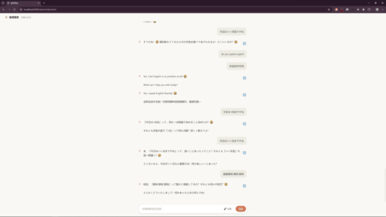

# Low-Latency Voice AI Agent with Barge-In Control (voice_app_v3_realtime)

> A browser-based voice AI agent with continuous microphone streaming, VAD-based turn detection, barge-in playback cancellation, streamed LLM text, path-aware Edge-TTS synthesis, DeepSeek Function Calling (11 tools), and AST sandbox security evaluation.

---

## 🎥 Demo Video / 演示動画



> 📥 **[点击直接下载 / 观看 1080P 高清演示视频 (demo.mp4)](https://github.com/chromenoka/voice_app_v3_realtime/raw/master/demo.mp4)**

---

## ✨ Key Technical Highlights / 核心技術と工夫点

1. **ASR Inference Decoupling (`asyncio.to_thread`)**
   - Offloads Whisper ASR inference to a thread pool to avoid blocking the main asyncio event loop.

2. **Path-Aware TTS Pipeline**
   - Ordinary, tool-free voice replies split streamed LLM output at safe clause boundaries and pre-synthesize segments concurrently for ordered playback.
   - Replies after a tool call are collected and synthesized in one Edge-TTS request to avoid unnecessary inter-segment pauses.

3. **VAD-Triggered Barge-In Playback Control**
   - Sustained user speech detected by WebRTC VAD plus an RMS gate sends a `START` signal and cancels the current LLM/TTS task.
   - The frontend stops the active audio element, revokes its URL, and clears queued audio. The project does not claim a formally measured full-duplex system.

4. **AST Sandbox Security Evaluation (`_safe_eval`)**
   - Completely removes `eval()`, implementing custom AST tree evaluation for safe arithmetic and DoS protection.

5. **Multi-Language TTS Voice Routing**
   - Text-content-only detection: hiragana/katakana → Japanese voice, pure Latin → English voice, otherwise Chinese voice.
   - No historical context contamination (prior Japanese conversation no longer forces Chinese/English into Japanese voice).

6. **Interactive UI & Function Calling Visualization**
   - Real-time `TOOL_CALL` and `TOOL_DONE` events via WebSocket driving a dynamic frontend orb animation.

---

## 🛠️ Architecture / システム構成

```text
[Browser (Web Audio API)] ──(WebSocket / PCM stream)──► [FastAPI Server]
                                                              │
              ┌───────────────────────────────────────────────┴──────────────────────────────┐
              ▼                                               ▼                              ▼
   [webrtcvad + RMS gate]                       [faster-whisper (Thread Pool)]  [DeepSeek LLM Agent]
   Turn detection                                Audio → Text (asyncio.to_thread)  Function Calling (11 Tools)
   configurable threshold / frames                                                           │
              │                                                                             ▼
              │ START signal ──────────────────────────────────────────────► [Edge-TTS (path-aware)]
              ▼                                                          normal: segments; tool: full reply
   [Frontend stopAudio()]                                                                   │
   Unbind onended → pause → revoke URL                                                     ▼
                                                                               [WebSocket send_bytes]
                                                                               Frontend Audio() plays
```


`main.py` currently initializes `faster-whisper` as `tiny / CPU / int8`. Intel Arc / DirectML acceleration is not claimed because the active CTranslate2 inference path does not use it.
---

## 🚀 Quick Start / 起動方法

```bash
# 1. Install dependencies
pip install -r requirements.txt

# 2. Configure API Key in .env
cp .env.example .env
# Edit .env and paste your DEEPSEEK_API_KEY

# 3. Launch server
python main.py

# 4. Open in browser
# http://localhost:8000/static/index.html
```

---

## 📋 Changelog

See [CHANGELOG.md](./CHANGELOG.md) for full version history.

